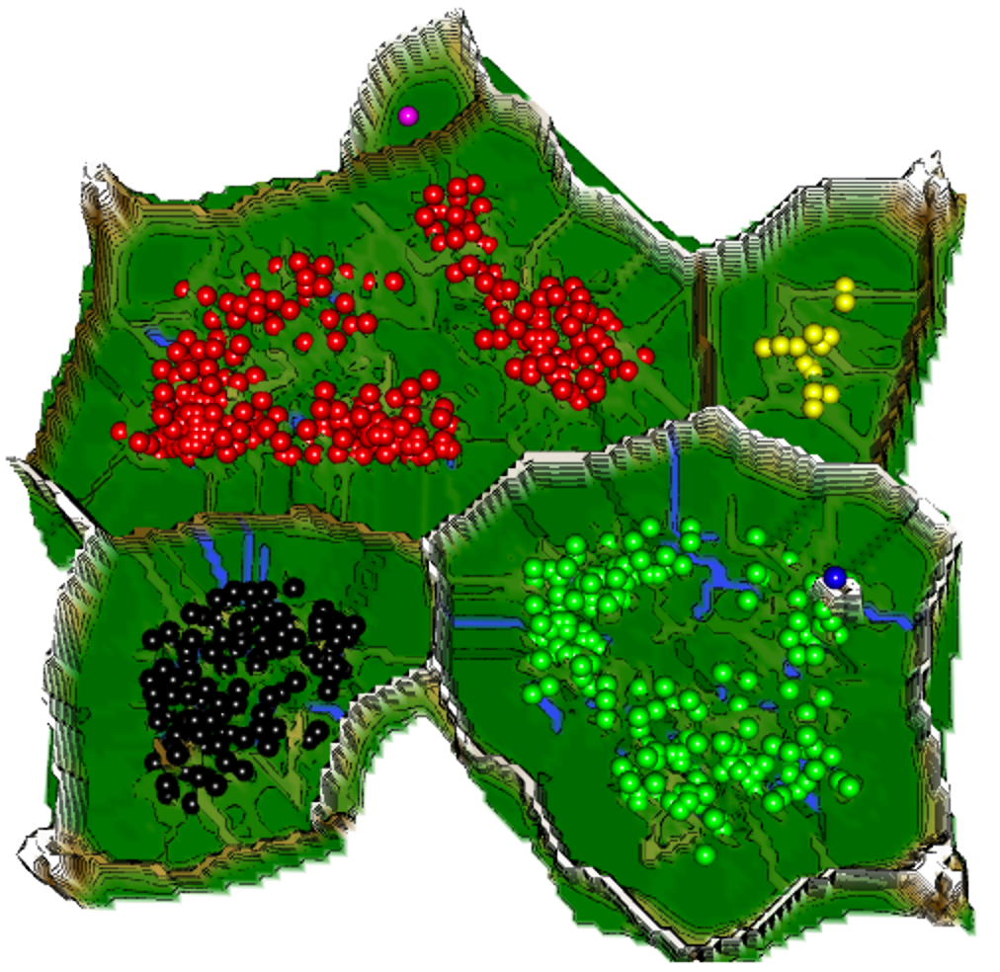

# Databionic Swarm
Algorithms implementing populations of agents that interact with one another and sense their environment may exhibit emergent behavior such as self-organization and swarm intelligence. Here, a swarm system called Databionic swarm (DBS) is introduced which was published in Thrun, M.C., Ultsch A.: "Swarm Intelligence for Self-Organized Clustering" (2020), Artificial Intelligence, <DOI:10.1016/j.artint.2020.103237>. DBS is able to adapt itself to structures of high-dimensional data such as natural clusters characterized by distance and/or density based structures in the data space. The first module is the parameter-free projection method called Pswarm (Pswarm()), which exploits the concepts of self-organization and emergence, game theory, swarm intelligence and symmetry considerations. The second module is the parameter-free high-dimensional data visualization technique, which generates projected points on the topographic map with hypsometric tints defined by the generalized U-matrix (GeneratePswarmVisualization()). The third module is the clustering method itself with non-critical parameters (DBSclustering()). Clustering can be verified by the visualization and vice versa. The term DBS refers to the method as a whole. It enables even a non-professional in the field of data mining to apply its algorithms for visualization and/or clustering to data sets with completely different structures drawn from diverse research fields. The comparison to common projection methods can be found in the book of Thrun, M.C.: "Projection Based Clustering through Self-Organization and Swarm Intelligence" (2018) <DOI:10.1007/978-3-658-20540-9>. A comparison to 26 common clustering algorithms on 15 datasets is presented on the website.

# Exemplary Topographic Map
 
The generalized U-matrix generates the visualization of a topographic map with hypsometric tints, which can be vividly described as a virtual 3D landscape with a specific color scale chosen with an algorithm defining the contour lines [24]. The topographic map addresses the central problem in clustering, i.e., the correct estimation of the number of clusters. It allows the assessment of the number of clusters [24] by inspecting the 3D landscape. The color scale and contour lines imitate valleys, ridges, and basins: blue colors indicate small distances (sea level), green and brown colors indicate middle distances (low hills), and shades of gray and white indicate vast distances (high mountains covered with snow and ice). Valleys and basins represent clusters, and the watersheds of hills and mountains represent the borders between clusters. In this 3D land-scape, the borders of the visualization are cyclically connected with a periodicity defined by two parameters (L,C).

[Download Figure as Interactive HTML](./docs/source/TopographicMap.html)
